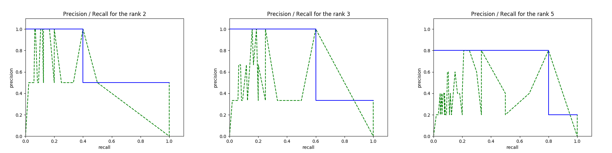
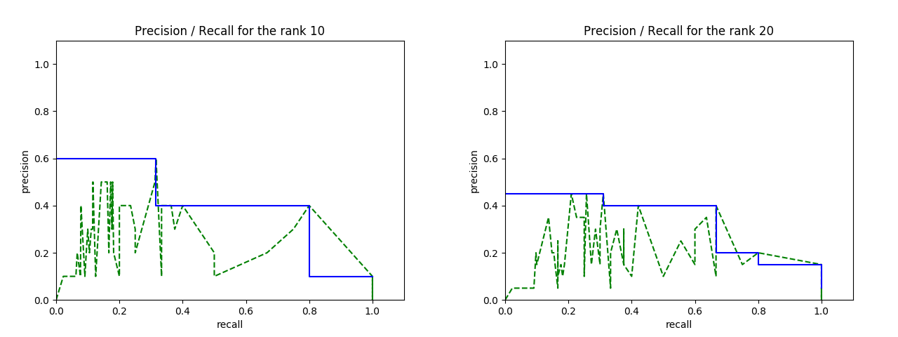
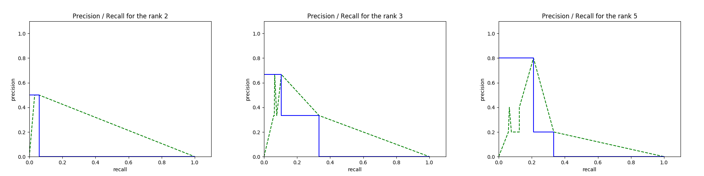
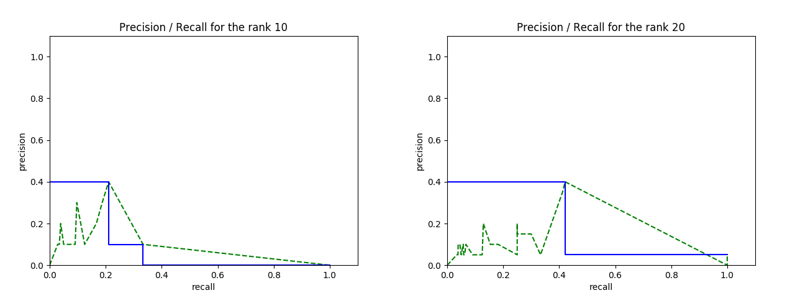

Joseph-Marie Valleix - Février 2017

# Projet de recherche d'information

Implémentation d'un moteur de recherche sur la collection CACM.

## Table des matières
<!-- vim-markdown-toc GFM -->
* [1. Installation](#1-installation)
    * [Requirements](#requirements)
    * [Données](#donnes)
* [2. Utilisation du programme](#2-utilisation-du-programme)
* [3. Structure du code](#3-structure-du-code)
* [4. Choix d'implémentation](#4-choix-dimplmentation)
    * [Remarques](#remarques)
    * [Déroulement du programme pour CACM](#droulement-du-programme-pour-cacm)
* [5. Résultats sur CACM](#5-rsultats-sur-cacm)
    * [Description de la collection CACM](#description-de-la-collection-cacm)
    * [Recherche vectorielle](#recherche-vectorielle)
        * [tf](#tf)
        * [idf](#idf)
    * [Temps d'indexation et de recherche](#temps-dindexation-et-de-recherche)
    * [Courbe Rappel/Précision, F-mesure et MAP](#courbe-rappelprcision-f-mesure-et-map)
        * [Pour tf-idf = card * 1 (pas de normalisation)](#pour-tf-idf--card--1-pas-de-normalisation)
        * [Pour tf-idf = card * log($\frac{nb\_of\_doc\_in\_collection}{nb\_of\_doc\_with\_token}$)](#pour-tf-idf--card--logfracnb_of_doc_in_collectionnb_of_doc_with_token)
        * [Pour tf-idf = $\frac{card}{card\_doc}$ * 1](#pour-tf-idf--fraccardcard_doc--1)
        * [Pour tf-idf = $\frac{card}{card\_doc}$ * log($\frac{nb\_of\_doc\_in\_collection}{1 + nb\_of\_doc\_with\_token}$)](#pour-tf-idf--fraccardcard_doc--logfracnb_of_doc_in_collection1--nb_of_doc_with_token)
* [Conclusion](#conclusion)
    * [Améliorations possibles](#amliorations-possibles)

<!-- vim-markdown-toc -->

## 1. Installation
### Requirements
- Python (3.5)
- nltk (3.2)
- matplotlib (2.0) et numpy (1.12) pour les plot

### Données
Dans un dossier `data`, copier les données de CACM tel que le contenu du dossier soit :

```
data/
  - cacm/
      - cacm.all
      - common_words
      - qrels.text
      - query.text
```

## 2. Utilisation du programme
Dans un shell :

```bash
python3 ri.py <source> <type> <flags>
# source : cacm (or cs276 - but the implementatio is not completed yet)
# type   : bin or vec for binary index and vectorial index

python3 ri.py cacm bin  # starts a search shell where the user can search the collection
python3 ri.py cacm vec --evaluate --plot  # run the tests on cacm
```

## 3. Structure du code
Le code est organisé de la façon suivante :

- `README.md`: source de ce rapport (généré avec `pandoc README.md -o readme.pdf --latex-engine xelatex`)
- `ri.py`: point d'entrée du programme, parse les arguments de la command line
- `data/`: collections de données
- `tools/`: contient le code spécifique aux différentes collections, chaque collection expose un ensemble de fonctions qui sont utilisées pour créer les indexes et effectuer les recherches
    - `cacm.py`: code de la collection cacm + common_words
    - `cs.py`: code de la collection cs276 (non fonctionnel)
    - `measure.py`: code contenant les fonction MAP, F1_measure et de plot pour les mesurer les performances des indexes
    - `search.py`: code pour la recherche, c'est ici que sont modifiables les poids tf-idf, dans les fonctions `normalize_term_in_document` et `normalize_term_in_collection`
    - `token.py`: code pour l'extraction des tokens

Note : la collection cs276 n'est pas encore intégrée mais le reste du programme est prêt : le code de recherche et d'indexation est modulaire et nécessite seulement que le module fournisse un ensemble de fonctions élémentaires nécessaires pour l'indexation (pour parser un document, extraire ses tokens etc.).

## 4. Choix d'implémentation

Au vu de la taille du jeu de données CACM, toutes les formes d'indexes et de traitements sont effectués en mémoire. Les données sources ne sont jamais lues une seconde fois après avoir été parsées.

L'indexe inversé est un dictionnaire python classique, donc une table de hachage : l'accès en lecture et en écriture est en O(1).

Les tokens sont filtrés avec la liste des `common_words` fournis par CACM, puis lemmatizés avec nltk et WordNet.


### Remarques
- la recherche binaire ne gère pour l'instant que l'union ou l'intersection des termes recherchés. Présentement, la recherche affiche l'union des résultats : ceci peut être modifié dans le fichier `tools/search.py` dans la fonction `binary_search` (cf. commentaire du code)
- dans le shell de recherche, taper `#123` renvoie les informations du document dont l'id est 123.

### Déroulement du programme pour CACM
1. les mots courants sont parsés,
1. les documents sont parsés dans un `NamedTuple` et leurs tokens sont immédiatement filtrés, lemmatizés et intégrés dans l'indexe inversé,
1. si besoin (pour l'indexe vectoriel), on enregistre au fur et à mesure le nombre de token de chaque document,
1. finalement, en fonction des paramètres de l'exécution :
    - soit le shell de recherche se lance pour l'utilisateur,
    - soit les tests de pertinences sont effectués sur la collection CACM

\newpage

## 5. Résultats sur CACM

### Description de la collection CACM

Voici le nombre de tokens dans CACM, sans lemmatisation :

- après suppression de la ponctuation et passage en minuscule : 116463
- après suppression des doublons : 10078
- après suppression des common_words : 9749

et avec lemmatisation :

- après suppression de la ponctuation et passage en minuscule : 113122
- après suppression des doublons : 8965
- après suppression des common_words : 8642

Ces résultats sont obtenus avec la fonction `get_all_tokens` de `tools/token.py`.

### Recherche vectorielle

Il est possible pour le modèle vectoriel de tester différents poids (ie différentes formules de tf-idf).
Dans le fichier `tools/search.py`, modifier les fonctions `normalize_term_in_document` et `normalize_term_in_collection` (plusieurs exemples de modèles sont en commentaires).

Différentes configuration de formules tf-idf ont été testées:

- sans normalisation ni par rapport à la collection, ni par rapport au document,
- avec normalisation par rapport à la collection ou au document,
- avec normalisation par rapport aux deux (tf-idf classique).

Les tf et idf sont choisi parmi les suivants :

#### tf
1. tf = card, ie pas de normalisation
1. tf = $\frac{card}{card\_doc}$
1. tf = log(1 + $\frac{card}{card\_doc}$).

avec

- card = cardinal de ce token dans le document
- card_doc = nombre de token en tout dans le document


#### idf
1. idf = 1, ie pas de normalisation,
1. idf = log($\frac{nb\_of\_doc\_in\_collection}{1 + nb\_of\_doc\_with\_token}$),
1. idf = log($\frac{nb\_of\_doc\_in\_collection}{nb\_of\_doc\_with\_token}$).

avec

- nb_of_doc_in_collection = nombre de documents dans la collection
- nb_of_doc_with_token = nombre de documents contenant ce token

### Temps d'indexation et de recherche

Lire, parser et indexer les common_words et la collection CACM prend sur un i5 sans parallélisation pour les 3204 documents :

- pour le modèle binaire : 2.05s,
- pour le modèle vectoriel : 2.30s,

soit environ 7ms par document.

Pour la recherche, le modèle binaire est sous la bare de la mili-seconde, le modèle vectoriel juste au dessus.
La recherche est donc quasi instantanée quelque soit le modèle implémenté choisi.

### Courbe Rappel/Précision, F-mesure et MAP

Quelques exemples de courbes rappels précisions, que l'on peut obtenir avec la command `python3 ri.py cacm vec --plot` (en modifiant le fichier `tools/search.py` (lignes ~80 et ~90) pour faire varier les poids) :

\newpage

#### Pour tf-idf = card * 1 (pas de normalisation)
Modèle naïf, très simple : le poids d'un document est égale au cardinal du token dans ce document.

- Average search time: 1.317ms (std deviation: 0.78)
- Mean Average Precision: 0.131
- Average F1 mesure :

	| Rank | Mean | st dev |
	|------|-------|--------|
	| 2 | 0.081 | 0.15 |
	| 3 | 0.079 | 0.14 |
	| 5 | 0.086 | 0.12 |
	| 10 | 0.109 | 0.11 |
	| 20 | 0.118 | 0.11 |


\newpage

#### Pour tf-idf = card * log($\frac{nb\_of\_doc\_in\_collection}{nb\_of\_doc\_with\_token}$)
Modèle plus intéressant : le poids des tokens est normalisé par rapport à la fréquence du terme dans la collection. Les résultats sont meilleurs (ceux sont même les meilleurs résultats du rapport).

- Average search time: 1.572ms (std deviation: 0.92)
- Mean Average Precision: 0.201
- Average F1 mesure :

	| Rank | Mean | st dev |
	|------|-------|--------|
	| 2 | 0.114 | 0.16 |
	| 3 | 0.127 | 0.15 |
	| 5 | 0.157 | 0.17 |
	| 10 | 0.168 | 0.14 |
	| 20 | 0.167 | 0.13 |





\newpage

#### Pour tf-idf = $\frac{card}{card\_doc}$ * 1

Cette fois le poids des tokens est normalisé par rapport à la fréquence du terme dans le document mais pas par rapport à la collection. Les résultats sont beaucoup moins bons, moins bons même que pour le modèle naïf.

- Average search time: 1.643ms (std deviation: 0.98)
- Mean Average Precision: 0.042
- Average F1 mesure :

	| Rank | Mean | st dev |
	|------|-------|--------|
	| 2 | 0.004 | 0.02 |
	| 3 | 0.015 | 0.05 |
	| 5 | 0.021 | 0.06 |
	| 10 | 0.026 | 0.06 |
	| 20 | 0.045 | 0.08 |





\newpage

#### Pour tf-idf = $\frac{card}{card\_doc}$ * log($\frac{nb\_of\_doc\_in\_collection}{1 + nb\_of\_doc\_with\_token}$)
tf-idf classique : on utilise la fréquence du terme dans le document et on normalise l'importance du terme par rapport à sa fréquence dans le corpus (avec un `+ 1` de normalisation). Les résultats sont moins bons que le modèle qui ne prend pas en compte la normalisation de la fréquence dans le document.

- Average search time: 1.646ms (std deviation: 1.00)
- Mean Average Precision: 0.103
- Average F1 mesure :

	| Rank | Mean | st dev |
	|------|-------|--------|
	| 2 | 0.032 | 0.11 |
	| 3 | 0.034 | 0.09 |
	| 5 | 0.053 | 0.11 |
	| 10 | 0.066 | 0.13 |
	| 20 | 0.090 | 0.13 |


\newpage

## Conclusion

Le meilleur MAP est obtenu lorsque l'on ne considère pas la fréquence du terme dans le document mais simplement son cardinal, ce qui est un peu surprenant. Cela est peut-être dû aux requêtes de références qui sont peu nombreuses et parfois étranges et par forcément appropriées pour un moteur de recherche vectoriel qui n'essaie pas de comprendre le sens de la requête. Par exemple :

> _Currently interested in isolation of root of polynomial; there is an old article by Heindel, L.E. in J. ACM, Vol. 18, 533-548.  I would like to find more recent material._

Ce projet permet d'effectuer des requêtes sur un index binaire ou vectoriel dans un shell, et permet également d'évaluer facilement un index sur la collection CACM. Le code est modulaire et prêt pour être utilisé avec d'autres collections.

### Améliorations possibles
- Il serait intéressant de finir l'intégration de cs276 pour faire un benchmark des performances de la création de l'index sur une plus grosse collection.
- La recherche binaire est encore rudimentaire, on pourrait implémenter un AST pour permettre des requêtes binaires complexes (`AND`, `OR`, `NOT`).
- Pour le moment, les termes de la requêtes sont filtrés comme un document du corpus l'est mais il n'y a pas de travail spécifique sur le poids de chaque token (pas de td-idf de la requête). Ceci pourrait être implémenté.
- De nouveaux algorithmes d'indexation pourraient être testés pour comparer leur résultats, comme BIM 25, les modèles de langues etc.


