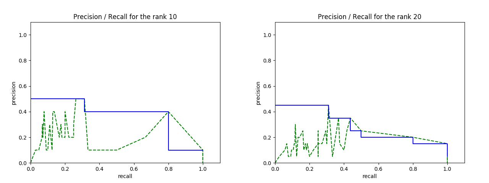

Joseph-Marie Valleix - Février 2017

# Projet de recherche d'information

## Table des matières
<!-- vim-markdown-toc GFM -->
* [Installation](#installation)
    * [Requirements:](#requirements)
    * [Données](#donnes)
* [Utiliser le programme](#utiliser-le-programme)
* [Structure du code](#structure-du-code)
* [Choix d'implémentation](#choix-dimplmentation)
    * [Déroulement du programme pour CACM](#droulement-du-programme-pour-cacm)
* [Résultats sur CACM](#rsultats-sur-cacm)
    * [Courbe Rappel/Précision, F-mesure et MAP](#courbe-rappelprcision-f-mesure-et-map)
* [Améliorations possibles et conclusion](#amliorations-possibles-et-conclusion)

<!-- vim-markdown-toc -->

## Installation
### Requirements:
- Python (3.5)
- nltk (3.2)
- matplotlib (2.0) et numpy (1.12) pour les plot

### Données
Dans un dossier `data`, copier les données de CACM tel que le contenu du dossier soit :

```
data/
  - cacm/
      - cacm.all
      - common_words
      - qrels.text
      - query.text
```

## Utiliser le programme
Dans un shell :

```bash
python3 ri.py <source> <type> <flags>
# source : cacm (or cs276 - but the implementatio is not completed yet)
# type   : bin or vec for binary index and vectorial index

python3 ri.py cacm bin  # starts a search shell where the user can search the collection
python3 ri.py cacm vec --evaluate --plot  # run the tests on cacm
```

## Structure du code
Le code est organisé de la façon suivante :

- `README.md`: source de ce rapport (généré avec `pandoc README.md -o readme.pdf --latex-engine xelatex`)
- `ri.py`: point d'entrée du programme, parse les arguments de la command line
- `data/`: collections de données
- `tools/`: contient le code spécifique aux différentes collections, chaque collection expose un ensemble de fonctions qui sont utilisés pour créer les indexes et effectuer les recherches
    - `cacm.py`: code de la collection cacm + common_words
    - `cs.py`: code de la collection cs276 (inachevé)
    - `measure.py`: code contenant les fonction MAP, F1_measure et de plot pour les mesurer les performances de notre recherche
    - `search.py`: code pour la recherche, c'est ici que sont modifiables les poids tf-idf, dans les fonctions `normalize_term_in_document` et `normalize_term_in_collection`
    - `token.py`: code pour l'extraction des tokens

Par manque de temps, cs276 n'est pas encore intégrée mais le reste du programme est prêt : le code de recherche et d'indexation est modulaire et nécessite seulement que le module fournisse un ensemble de fonctions élémentaires (pour parser un document, extraire ses tokens).

## Choix d'implémentation

Au vu de la taille du jeu de données CACM, toutes les formes d'indexes et de traitements sont effectués en mémoire.

L'indexe inversé est un dictionnaire python classique, donc une table de hachage : l'accès en lecture et en écriture est en O(1).

Les tokens sont filtrés avec la liste des `common_words` fournis, puis lemmatizés avec nltk+WordNet.

### Remarques
- la recherche binaire affiche l'union des résultats, ceci peut être modifié dans le fichier `tools/search.py` dans la fonction `binary_search` (cf. commentaire du code)
- dans le shell de recherche, taper `#123` renvoie les informations du document dont l'id est 123.

### Déroulement du programme pour CACM
1. les mots courants sont parsés,
1. les documents sont parsés dans un `NamedTuple` et leurs tokens sont immédiatement filtrés, lemmatizés et intégrés dans l'indexe inversé,
1. si besoin (pour l'indexe vectoriel), on enregistre au fur et à mesure le nombre de token de chaque document,
1. finalement :
    - soit le shell de recherche se lance pour l'utilisateur,
    - soit les tests de pertinences sont effectués sur la collection CACM

## Résultats sur CACM

### Description de la collection CACM

Nombre de tokens dans CACM, sans lemmatisation :

- après suppression de la ponctuation et passage en minuscule : 116463
- après suppression des doublons : 10078
- après suppression des common_words : 9749

Avec lemmatisation :

- après suppression de la ponctuation et passage en minuscule : 113122
- après suppression des doublons : 8965
- après suppression des common_words : 8642

Ces résultats sont obtenus avec la fonction `get_all_tokens` de `tools/token.py`.

### Recherche vectorielle
Les différentes configuration de formules tf-idf ont été testées:

#### tf
1. tf = card, ie pas de normalisation
1. tf = $\frac{card}{card\_doc}$
1. tf = log(1 + $\frac{card}{card\_doc}$).

avec

- card = cardinal de ce token dans le document
- card_doc = nombre de token en tout dans le document


#### idf
1. idf = 1, ie pas de normalisation,
1. idf = log($\frac{nb\_of\_doc\_in\_collection}{1 + nb\_of\_doc\_with\_token}$),
1. idf = log($\frac{nb\_of\_doc\_in\_collection}{nb\_of\_doc\_with\_token}$).

avec

- nb_of_doc_in_collection = nombre de documents dans la collection
- nb_of_doc_with_token = nombre de documents contenant ce token

#### Commentaires
Le troisième tf (qui n'est pas très canonique) et le troisième idf donnent les meilleurs résultats.

Pour tester les différents tfidf facilement, voir le fichier `tools/search.py`, les fonctions `normalize_term_in_document` et `normalize_term_in_collection` et décommenter les formules alternatives.

### Temps d'indexation et de recherche

 TODO
 TODO
 TODO
 TODO
 TODO
 TODO
 TODO

### Courbe Rappel/Précision, F-mesure et MAP

Quelques exemples de courbes rappels précisions, que l'on peut obtenir avec la command `python3 ri.py cacm vec --plot`, en modifiant le fichier `tools/search.py` (lignes ~80 et ~90) :

#### Pour tf-idf = card * 1 (pas de normalisation)
Modèle très simple : le poids d'un document est égale au cardinal du token dans ce document.

- Average search time: 1.317ms (std deviation: 0.78)
- Mean Average Precision: 0.131
- Average F1 mesure :

	| Rank | Mean | st dev |
	|------|-------|--------|
	| 2 | 0.081 | 0.15 |
	| 3 | 0.079 | 0.14 |
	| 5 | 0.086 | 0.12 |
	| 10 | 0.109 | 0.11 |
	| 20 | 0.118 | 0.11 |




#### Pour tf-idf = $\frac{card}{card\_doc}$ * log($\frac{nb\_of\_doc\_in\_collection}{1 + nb\_of\_doc\_with\_token}$)
tf-idf plus classique : on utilise la fréquence du terme dans le document et on normalise l'importance du terme par rapport à sa fréquence dans le corpus (avec un `+ 1` de normalisation).

- Average search time: 1.646ms (std deviation: 1.00)
- Mean Average Precision: 0.103
- Average F1 mesure :

	| Rank | Mean | st dev |
	|------|-------|--------|
	| 2 | 0.032 | 0.11 |
	| 3 | 0.034 | 0.09 |
	| 5 | 0.053 | 0.11 |
	| 10 | 0.066 | 0.13 |
	| 20 | 0.090 | 0.13 |


## Améliorations possibles et conclusion
Ce projet permet d'effectuer des requêtes sur un index binaire ou vectoriel dans un shell, et permet également d'évaluer facilement un index sur la collection CACM. Le code est modulaire et prêt pour être utilisé avec d'autres collections.

- Il serait intéressant de finir l'intégration de cs276 pour faire un benchmark des performances de la création de l'index sur une plus grosse collection.
- La recherche binaire est encore rudimentaire, on pourrait implémenter un AST pour permettre des requêtes binaires complexes (`AND`, `OR`, `NOT`).
- Pour le moment, les termes de la requêtes sont filtré comme un document du corpus l'est mais il n'y a pas de travail spécifique sur le poids de chaque token (pas de td-idf de la requête).
- De nouveaux algorithmes d'indexation pourraient être testés pour comparer leur résultats, comme BIM 25, les modèles de langues etc.


